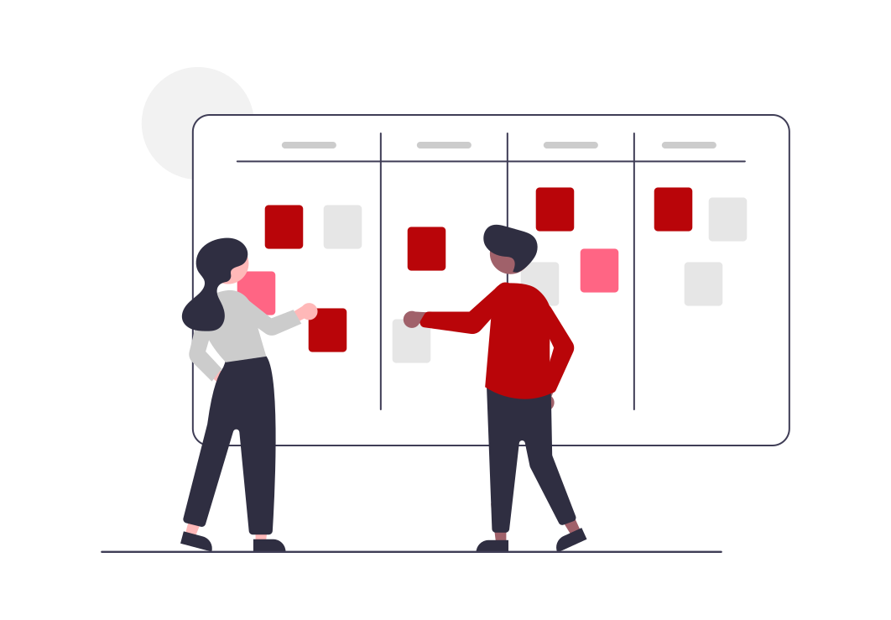

# What Will We Talk About Today? 🗣🎙

* Document Object Model (DOM)
* DOM API
* How can we use **JavaScript** to manipulate a web page?
  * Selecting Elements
  * Creating Elements
  * Changing attributes and styles
  * Listening on element events

## Objective 🎯
* To understand the DOM APIs.
* To apply that understanding to build a simple web application.

