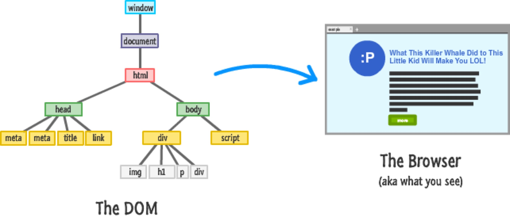
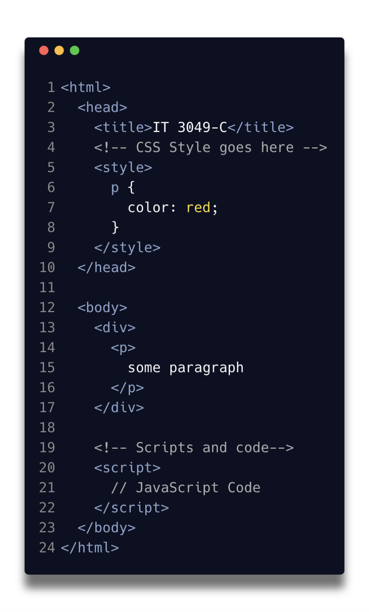

## Web API
* API, stands for application programming interface.
* There are a [ton of APIs](https://developer.mozilla.org/en-US/docs/Web/API) that are available for you to use when developing for the Web.
* Examples:
  * [**Console**](https://developer.mozilla.org/en-US/docs/Web/API/Console_API) - we use it for debugging.
  * [**Clipboard**](https://developer.mozilla.org/en-US/docs/Web/API/Clipboard_API) - respond and manage clipboard actions (cut, copy, paste)
  * [**GeoLocation**](https://developer.mozilla.org/en-US/docs/Web/API/Geolocation_API) - Get Geo Location information
  * **Storage** - Store data across sessions in the browsers
  * **Document Object Model (DOM)** - Our topic for the day

## Web API - Document Object Model (DOM)
* DOM is how we relate HTML code to JavaScript.
* the API allows us to interact with the current state of the web page.
  * Listen to events and actions
  * modify styles, and attributes
  * *The whole point of introducing a programming language into the browsers.*
  * It's not a part of the JS language, but a web api provided by all browsers. 
    * *You can use it with python*

### How does it relate the HTMl code to JS code. 
* DOM is a data representation (tree structure) of the objects that makes us the web page document structure.
  * Every branch ends with a node, every node can further branch out.
  * Every node can have some event handlers attached to respond to certain actions.
* 
* 
* 

# Selecting Elements
## Selectors
* The DOM API uses the same selectors as CSS
  * Universal selector (*)
  * Type Selector: `<div>`, `<p>`, ... 
  * Class Selector: `.sections`, ...
  * ID Selector: `#some Element`
  * Attribute Selector: `[attr=value]`

## Combining Selectors
* You can further define elements by combining selectors
  * descendant `" "`
  * child `>`
  * and others.

## Selection methods
* `document.getElementById()` – select an element by id.
* `document.getElementsByClassName()` – select elements by one or more class names.
* `document.querySelector()` – select elements by CSS selectors. returns a static snapshot
* Less commonly used
  * `getElementsByName()` – select elements by name.
  * `getElementsByTagName()` – select elements by a tag name.


### Demo: Open `examples/features/index.html`
* Review the file, identify ways we can select different items
* Modify certain styles using css
  * try modifying .text-dark to use the color red
  * why did it not work?
* using the browser console access .module elements
  * Q: should class names be unique for the page? what happens if that's not the case?
  * Q: should IDs be unique for the page? what happens if that's not the case?
  * use `getElementsByClassName`
  * use `querySelector`
* **Note:** The NodeList returned by querySelectorAll() is not live, which means that changes in the DOM are not reflected in the collection. This is different from other DOM querying methods that return live node lists.

# Traversing the DOM
If you move directly from your house to their house, you’re doing the equivalent of traversing the DOM—selecting one element from a neighboring element.

If you lookup their address on Google, you’re doing the equivalent of document.querySelector to find elements.

```html
<div class="neighborhood">
  <div class="your-house">😎</div>
  <div class="neighbor-house">🎉</div>
</div>
```

* You can traverse in three directions:
  * Downwards - get child elements
  * Sideways - get siblings of an element
  * Upwards - get parent of an element.

## Downwards (child elements)
### using selectors methods
```html
<div class="component">
  <h2 class="component_title">Component title</h2>
</div>
```
```js
const component = document.querySelector('.component')
const title = component.querySelector('.component_title')

console.log(title) // <h2 class="component_title"> ... </h2>
```
you could search globally by doing
```js
// the equivalent for giving the full address
const component = document.querySelector(`.component > component_title`);
```

### using `children` property
```html
<ul class="list">
  <li><a href="#">Link 1</a></li>
  <li><a href="#">Link 2</a></li>
  <li><a href="#">Link 3</a></li>
  <li><a href="#">Link 4</a></li>
  <li><a href="#">Link 5</a></li>
</ul>
```

```js
const list = document.querySelector('.list')
const listItems = list.children

const thirdItem = listItems[2];

console.log(listItems);
console.log(thirdItem);
```

## Upwards (parent elements)
### using `parentElement` property
```html
<ul class="list">
  <li><a href="#">Link 1</a></li>
  <li><a href="#">Link 2</a></li>
  <li><a href="#">Link 3</a></li>
  <li><a href="#">Link 4</a></li>
  <li><a href="#">Link 5</a></li>
</ul>
```
to access the list element through any of the list items
```js
const firstListItem = document.querySelector('li')
const list = firstListItem.parentElement

console.log(list)
```

### using `closest` method
where the parent may be 1 or more levels up, you could use the `closest()` method
```html
<ul class="list">
  <li><a href="#">Link 1</a></li>
  <li><a href="#">Link 2</a></li>
  <li><a href="#">Link 3</a></li>
  <li><a href="#">Link 4</a></li>
  <li><a href="#">Link 5</a></li>
</ul>
```
```js
const firstLink = document.querySelector('a')
const list = firstLink.closest('.list') // closest Ancestor

console.log(list)
```

## Sideways 
### using `previousElementSibling` and `nextElementSibling` properties

```js
const firstListItem = document.querySelector('li')
const secondListItem = firstListItem.nextElementSibling;
const thirdListItem = secondListItem.nextElementSibling;

console.log(secondListItem)
```
```js
const secondListItem = document.querySelectorAll('li')[1]
const firstListItem = secondListItem.previousElementSibling

console.log(firstListItem)
```

## Demo: Open `examples/features/index.html`
<!-- TODO: Make some stuff here -->

# Manipulating the DOM
## What are the properties that are available for us to modify
* Every element has a set of (1) properties, (2) methods, and (3) events. Some are unique to the element itself, others are inherited from a parent element type. [Anchor `<a>`, as an example](https://developer.mozilla.org/en-US/docs/Web/API/HTMLAnchorElement)
* [This is a list of all the HTML Element](https://developer.mozilla.org/en-US/docs/Web/API/HTML_DOM_API#html_element_interfaces_2). 
* All Elements have properties and methods that are specific to them, as well as more general ones that belong to all of them. 


## Creating and placing new elements
```js
const section = document.querySelector('section');
const paragraph1 = document.createElement('p');
paragraph1.textContent = 'This is my first paragraph';
const paragraph2 = document.createElement('p');
paragraph2.textContent = 'This is my second paragraph (I will probably want to remove this)';

section.appendChild(paragraph1);
section.appendChild(paragraph2);

section.removeChild(paragraph2);
// to remove self (just use remove)
```


## Change Attributes
* `TextContent`
* `HTMLContent`
* Input type
  * date
  * text
  * password

## Change Styles
### by modifying the style property
any HTMLElement has a style property
```js
para.style.color = 'white';
para.style.backgroundColor = 'black';
para.style.padding = '10px';
```
### by modifying class names
* `element.setAttribute('class', 'highlight');`
* `element.classList.add('highlight')`
#### Demo: Implementing Dark Mode
```html
<main class="light-mode">
  <p>
    This is light
  </p>
  <button>Turn on Dark Mode</button>
</main>
```

```css
p {
  font-weight: bold;
}

.light-mode {
  background-color: #e9e9e9;
  color: #b60000;
}

.dark-mode {
  background-color: #1b1b1b;
  color: #fcff4e
}
```
* Switch back and Forth between the 2 class names.
* **Demo:** do it through the console
  * Create the function and call it

## Listening to event handlers
### `onclick` 
```html
<main class="light-mode">
  <p>
    This is light
  </p>
  <button onclick="toggleDarkMode()">Turn on Dark Mode</button>
</main>
```
```js
  function toggleDarkMode() {
   const mainElement = document.getElementByTagName(`main`);
   mainElement.classList.add("dark-mode");
   mainElement.classList.remove("light-mode");
  //  mainElement.classList.toggle("dark-mode")
}
```
### `addEventListener()`
to add the listeners dynamically
```html
<main class="light-mode">
  <p>
    This is light
  </p>
  <button onclick="toggleDarkMode()">Turn on Dark Mode</button>
</main>
```
```js
  const toggleButton = document.querySelector(`button`);

  toggleButton.addEventListener(`click`, toggleDarkMode)
```

```html
<main class="light-mode">
  <input id="userName" type="text"/>
  <p>
    Hello, 
  </p>
</main>
```
```js
  const paragraphElement = document.getElementByTagName(`p`);
  const userNameInput = document.querySelector(`#userName`);

  userNameInput.addEventListener(`input`, function (event){
    paragraphElement.textElement = `Hello, ${event.target.value}`
    // paragraphElement.textElement = `Hello, ${userNameInput.value}`
  })
```