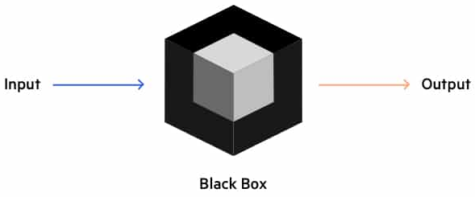

## Web API
* API, stands for **A**pplication **P**rogramming **I**nterface.
* It's a black box of functionality.
  * Developers would provide documentation for what it does and how you can use it.

## Web API - Document Object Model (DOM)
* DOM API is how we relate HTML code to JavaScript.
* *The whole point of introducing a programming language into the browsers.*
