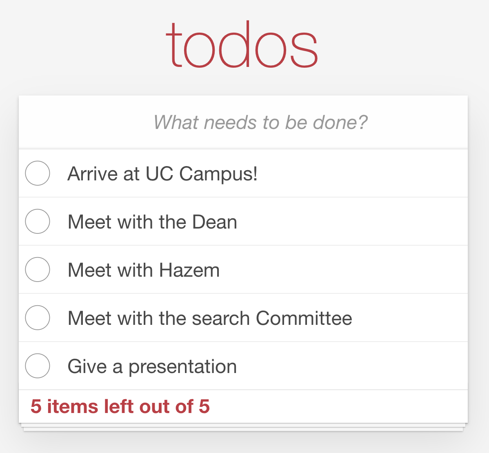

## Todo Application


### Exercise1: Selecting elements
* Open [index.html](../index.html) and [todo.js](../assets/scripts/todo.js)
* Review the HTML
* Create three variables that hold references to:
  * New Todo Input Field
    * ```html
      <input id="new-todo" placeholder="What needs to be done?" autofocus>
      ```
  * The Todo List `<ul>`
    * ```html
      <ul id="todo-list">
      ```
  * (optional) the todo-counter

<div style="align-items: center;">
  
</div>