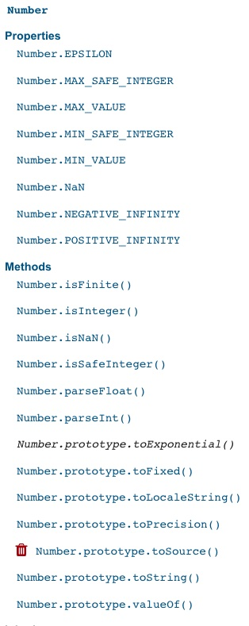

## Data Types
### Number
#### Built-in properties and methods
* [Number Data Type documentation](https://developer.mozilla.org/en-US/docs/Web/JavaScript/Reference/Global_Objects/Number)
* There are instance methods, and static methods.
    * Instance methods are called on an instance of the type.
    * Static methods are called on the type itself. (aren't tied to any specific instance)
* Notice how some methods are named `Number.<method name>` vs `Number.prototype.<method name>`
  * 
